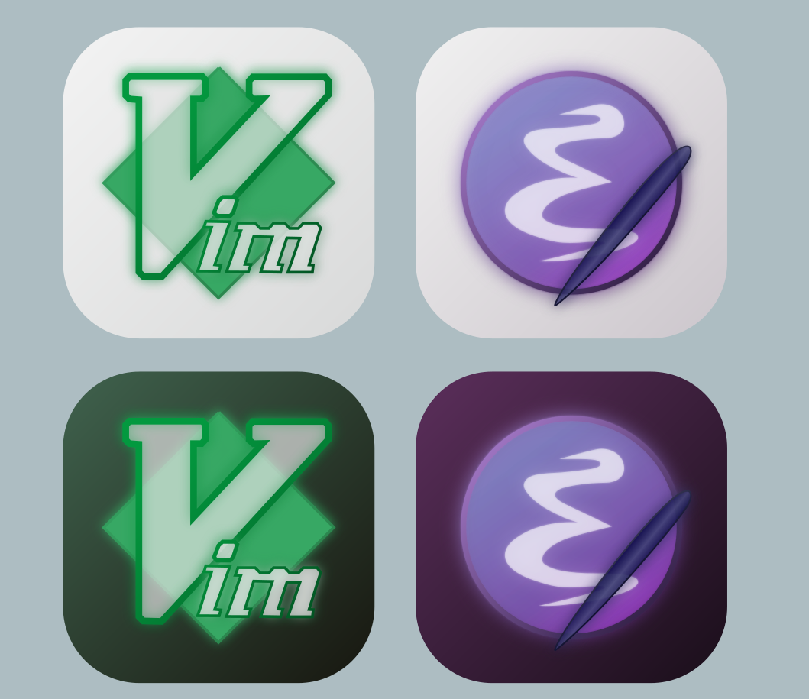

## Glassmorphic Editor Icons

Glassmorphic Editor Iconsはグラスモーフィズムに基づくVimとEmacsのアイコンアセットです。
- ライトテーマとダークテーマ
- Vim,Emacs
- 角丸ありと角丸なし

の8パターンのアイコンを含みます。

## devs
本アイコンはinkscapeによって編集され、そのオリジナルファイルはinkscape svg形式でinkscape-devsディレクトリに保存されています。

`./svg/*.svg`はアイコンごとにinkscapeから手動でエクスポートされたSVG形式のアイコンです。
`./pngs/*.png`はアイコンごとにinkscapeから手動でエクスポートされた1024x1024のPNG形式のアイコンです。また、`./pngs`ディレクトリのサブディテクトリにはそれぞれのアイコンの縮小版が保存されいます。これらの縮小版のアイコンは`png-generate.sh`により`Imagemagick`を用いて自動生成されたものです。

## License
本プロジェクトは全てGNU GPL v3 Licenseの下に提供されます。詳細は`./NOTICE.txt`を確認してください。完全なライセンステキストについては、`./LICENSE`を参照してください。
また、vimのアイコンについてはGPL v3のアイコンから派生しているものの、間接的にvimの派生物に該当する可能性があることから、vimのライセンスに基づき`./vim-license.txt`にVim Licenseファイルを添付しています。

## 著作権
`./NOTICE.txt`を参照してください。